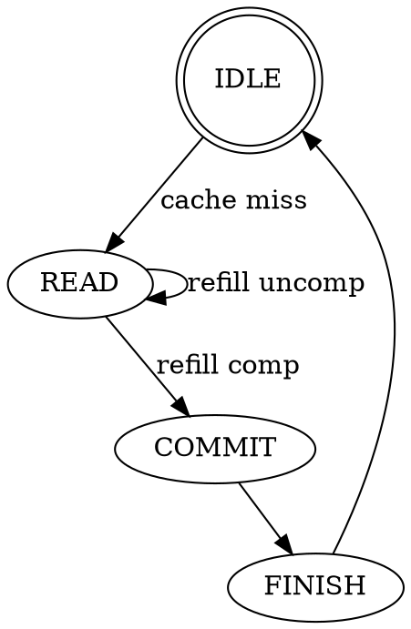

# 简易缓存
ICache 状态机

```dot
digraph icacheFSM{
	IDLE[shape="doublecircle"]
	IDLE->READ[label="cache miss"]
	READ->READ[label="refill uncomp"]
	READ->COMMIT[label="refill comp"]
	COMMIT->FINISH
	FINISH->IDLE
}
```